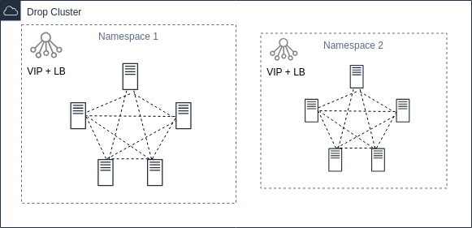

# Welcome to DROP (Distributed Reliable Operation Platform)

## Cluster
Cluster is all shared machine resources (nodes)

## Nodes
Nodes are resources  of machines with the DROP installed.
Can be combined into groups (Namespaces) on the basis of - security, resources, scheduler ..

## Namespace 

Namespace is a logical group that includes one or more nodes. 
After creation, nodes join together within this group. 
Nodes can move between groups without downtime.

Each namespace has:

1. floating IP address
2. L4/L7 balancer
3. Scheduler

All administrative commands can be executed within one namespace

## Services

Services - services external to the platform (systemd services) that can be 
launched and accompanied by the platform.

Within the namespace, you can set the number of required services that will be maintained in the desired state and number in the event of nodes falling out or reconfiguration

## Function

Actually, this is the same atomic unit of calculation. It can be a system (for example, a scheduler, a node state, events ..) or a user (directly those containers that perform CPU-bound tasks).

    #
    # Python func example
    #

    import sys
    import time

    # API

    def read():
        msg = sys.stdin.readline()
        return msg.strip()

    def log(m):
        sys.stderr.write("{}: {}\n".format(time.time(), m))
        sys.stderr.flush()

    def send(m):
        sys.stdout.write("{}\n".format(m))
        sys.stdout.flush()

    # Process - actor
    #  read - recieve message from world
    #  send - send message to world
    #  log  -  logging anything

    def main(t):
        while 1:
          msg = read()
          if not msg:
              break
    
          log("start working..")
          log("get message: " + msg)
    
          resp = "{}".format(msg)
    
          send(resp)
    
          log("message send: {}".format(resp))
    
    
    if __name__ == "__main__":
      main(sys.argv[1])
    

## Pool

This is a logical element that includes one or more computational functions.
The pool has elastic characteristics (size, timeouts, launch strategies ..)
All messages are asynchronous
A pool can subscribe to events of another pool (both local and distributed)
May subscribe to events coming from him
Selective reception of messages - subscription to messages with a specific label
Strategies for posting a message in a pool: free, all, function ..
There is a cache
Registered in a distributed environment by name

## Flow

Flow is a computational function declaration (YAML), or a certain route / subscription script, or execution of instruction sets. 
One flow can have multiple scenarios. 
For example, pool start scripts, strategies for subscribing to other pools, stopping the pool.

    # func declare example
    name: pyex
    func:
        - name: pyex
        image: pyex:0.1.0
        cmd: /usr/bin/python pyex.py 1

## Plugin

Plugins are a set of system functions that extend the functionality of the platform.

